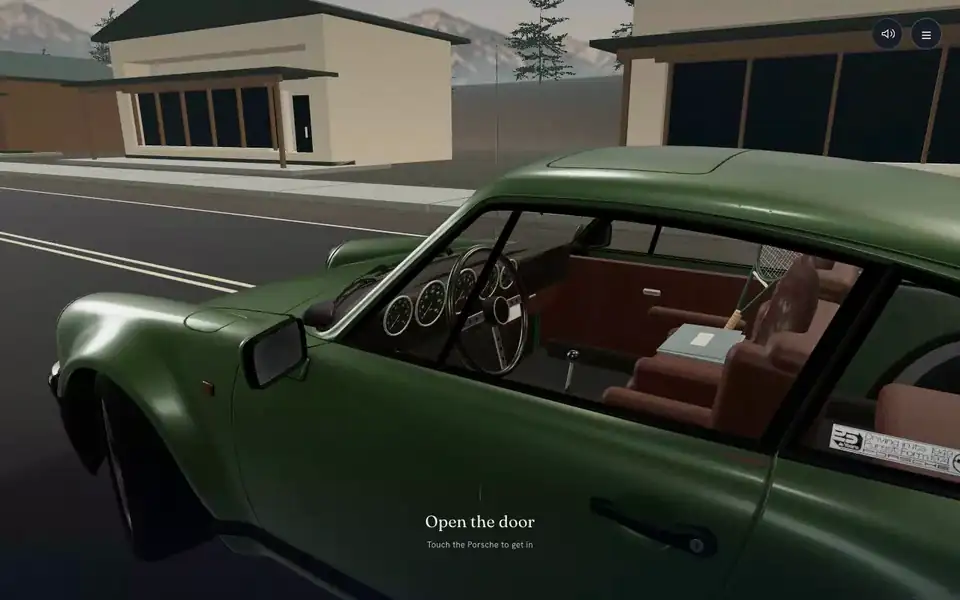

# brycerambach.com

<a href="https://brycerambach.com"></a>

My portfolio, which you visit from the driver's seat of a green Porsche 911.

You open the door, find a note from me in the glovebox and turn the key. Then the car drives you out of town toward Lake Tahoe, and notes about my work come up between stops. There's a café and a tennis court on the way if you want to pull in. At the lake you get the wheel for the race home.

**[Take the drive](https://brycerambach.com)**, or skip straight to [the projects](https://brycerambach.com/projects).

## Driving

The car is on autopilot until the lake, so you can just look around. Drag, or use the arrow keys. The on-screen buttons handle steering, the brake and accelerator, the horn and pulling over, and they work with touch.

The engine sound, the tachometer and the gauges all read from one drivetrain model, so what you hear matches the needles.

## How it's built

React 19, TypeScript, Vite and Three.js, with Tailwind CSS and Motion for everything outside the car.

| File | What it does |
| --- | --- |
| `src/prototype/Entrance.tsx` | The way in, the cabin controls and the driving instruments |
| `src/prototype/car-scene.ts` | Renderer, car, camera and the objects you can pick up |
| `src/prototype/city-route.ts` | Autopilot, manual driving and parking |
| `src/prototype/engine-sound.ts`, `car-audio.ts` | The drivetrain state and the recorded engine layers |
| `src/prototype/render-quality.ts` | Lowers the canvas resolution when frames run slow |
| `src/projects/` | The project pages at `/projects` |

## Run it

```bash
npm ci
npm run dev    # http://localhost:3000
```

Before pushing:

```bash
npm run lint
npm test
npm run build
```

Every push to `main` deploys to brycerambach.com through Vercel.
