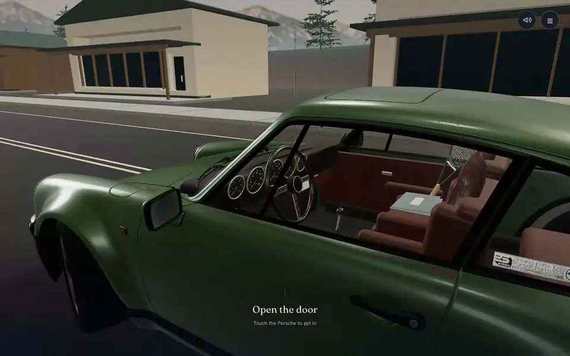
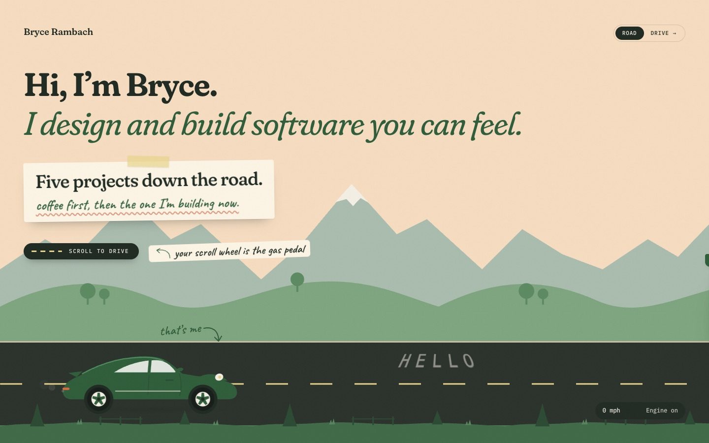
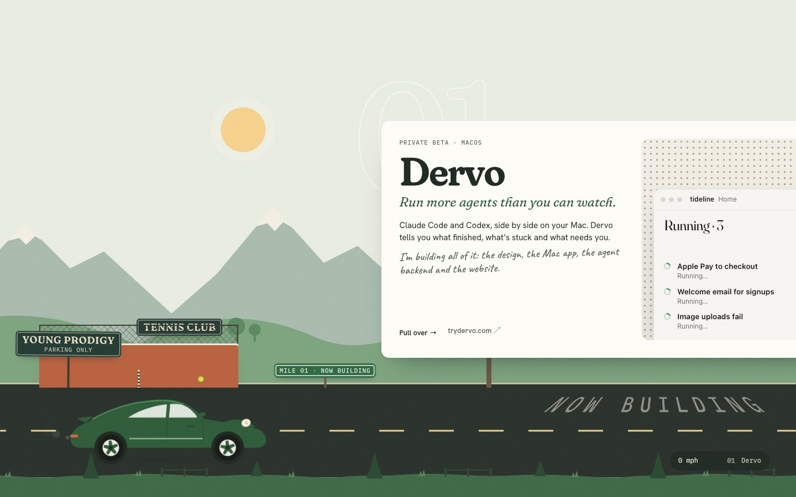
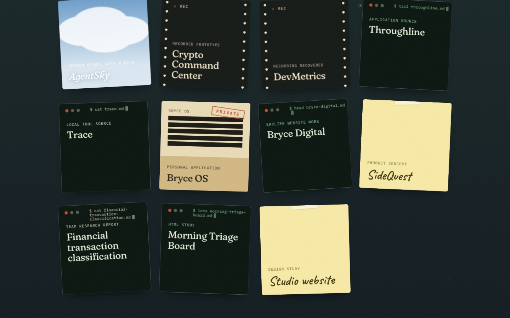
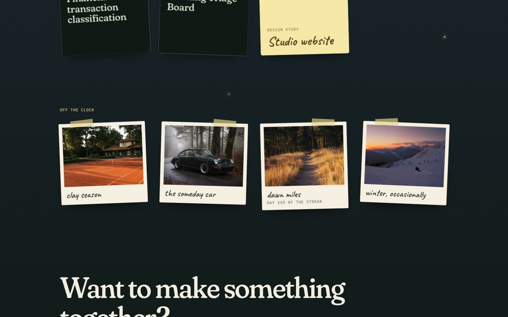
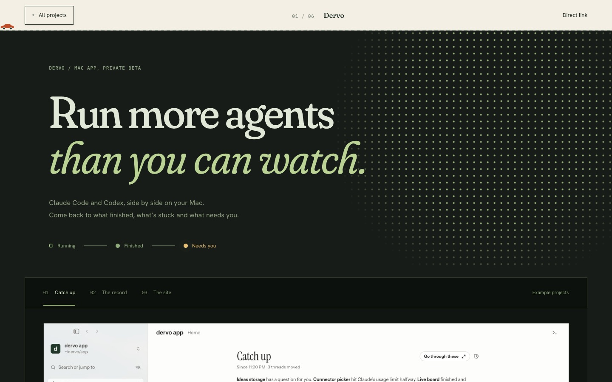
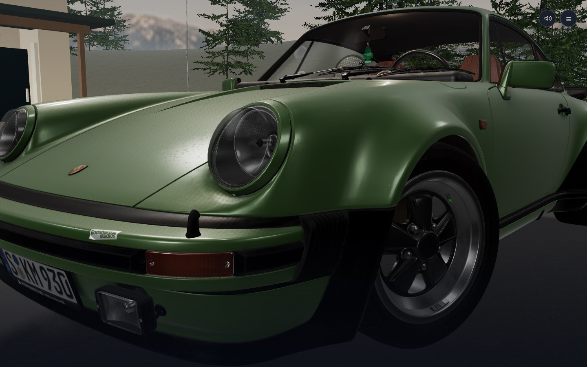

# brycerambach.com

<a href="https://brycerambach.com"></a>

My portfolio. The front page is quiet: one column of text at night, with a flat green 911 you can drag around it. The words step aside and light up as it passes. The earlier site is still here. You can scroll down a road where the 911 drives past a billboard for each thing I've made, or take the wheel of a 3D Porsche, open the door, find a note in the glovebox, turn the key and drive out of town toward Lake Tahoe.

**[Start at the front page](https://brycerambach.com)**, or skip to [the projects](https://brycerambach.com/projects), [take the road](https://brycerambach.com/work), or [take the wheel](https://brycerambach.com/drive).



## What's in it

| Where | What it is |
| --- | --- |
| `/` | The front page. One column of text on a deep green ground, set in Sentient, with the work list, a few photos and a flat 911 you can drag over the words. Tap the car and it says something. `/next` is an alias, and `?look=ink` or `?look=bone` shows the other two palettes. |
| `/work` | The road. Scrolling drives the car past a billboard per project, with Dervo first. Coffee shop and tennis club on the way, a night stop at the end with the archive as a pile of cards, and a few photos from off the clock. |
| `/projects/<name>` | A study for each project: Dervo, the integration portal, Lucid, Arro, Port and AgentSky. Each one has something you can poke, not just screenshots. They wear the front page's night look. |
| `/drive` | The 3D Porsche. Open the door, turn the key, drive from town to a Tahoe-style overlook. `/drive?from=work` skips the walk-up. |
| `/previous` | The earlier version of the site, kept around. |



### The end of the road

The archive lives in the glovebox. Each card is made of what it is: recordings are film strips, source-only work is a terminal window, the private one is a folder with redaction bars, concepts are sticky notes. Hover or tab to one and it opens onto the honest note about what survives of it.





### The studies



Every study says what's real and what isn't. Dervo is in private beta and its screens show example projects. The integration portal is employer-owned work, so it's redrawn with a fictional cast and nothing in it talks to a backend. Nothing is presented as adoption or results that were never measured.

### The drive



| Control | Action |
| --- | --- |
| W / Up | Accelerate |
| S / Down | Brake |
| A / D or Left / Right | Steer |
| Q / E | Downshift / upshift |
| Space | Pull over |
| K | Start the engine |
| H | Horn |
| Cruise button | Follow the road and traffic automatically |

Touch controls work too. The scene credits (models, sounds, textures) are in the drive's menu.

## Built with

React 19, TypeScript, Vite 6 and Tailwind 4 for the pages, plus plain CSS where a component owns its look. [Motion](https://motion.dev) and Lenis for the movement, Three.js r185 for the drive, Vitest for tests. It deploys on Vercel, and the functions in `api/` back the race times and a private admin page.

## Run it

```bash
npm ci
npm run dev
```

The dev server starts on http://localhost:3000. To pick a port, `npm run dev -- --port 3001 --strictPort`.

Before pushing:

```bash
npm run lint    # tsc --noEmit
npm test        # vitest
npm run build   # vite build
```

Every push to `main` deploys to brycerambach.com through Vercel, so a pull request is the safer way in: Vercel builds a preview of it first.

The race times and admin functions need Upstash/KV environment variables that aren't in the repo. Everything else runs without them.

## Where things are

| Path | What's there |
| --- | --- |
| `src/main.tsx` | Routing. It's path-based, with no router library. A new route also needs a rewrite in `vercel.json`. |
| `src/projects/SimplePortfolio.tsx` | The road: the scroll-driven scene, billboards and stops. |
| `src/projects/Glovebox.tsx` | The night stop at the end. |
| `src/projects/catalog.ts` and `road-lineup.ts` | Project data, and the order and covers shared by the road and the 3D billboards. |
| `src/projects/*Study.tsx` | One file per study. `StudyKit.tsx` holds the shared motion. |
| `src/projects/PortalStudy.tsx` | The integration portal redraw (`portal.css`). |
| `src/prototype/` | The 3D drive: scene, route, traffic, audio, the cabin objects. |
| `src/index.css` | Design tokens, type roles, and the one poke and one stamp every control shares. |
| `docs/site-personality.md` | The taste, motion and voice rules the site follows. |
| `docs/implementation/` | Plans and history for the drive. |

## How it's meant to feel

One big type decision per screen in serif display. Photography carries the colour and the interface stays quiet. Forest and cream, with one warm accent spent on small marks. Paper, tape and handwriting so it feels made. One statement move per screen, ambient loops kept slow, and a reduced-motion setting that is respected. No hard offset shadows, no thick borders. The full version is in `docs/site-personality.md`.

## Licence

No open-source licence is attached, so treat it as all rights reserved. The 3D, audio and texture assets carry their own terms, credited in the drive. If you want to reuse something, ask.
